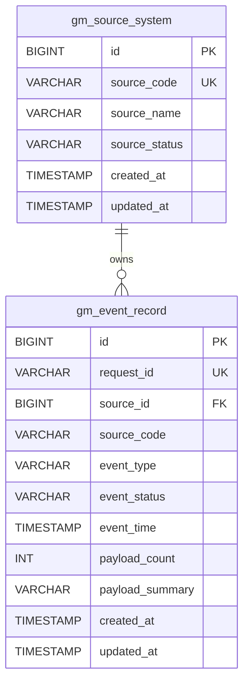

# GoldenMount ER v1 草案

## 1. 设计目标

为第一次联调提供最小可落库模型，覆盖“来源系统管理”和“事件接收记录”两类核心实体。

## 2. 实体说明

### 2.1 `gm_source_system`

| 字段 | 类型 | 约束 | 说明 |
| --- | --- | --- | --- |
| `id` | BIGINT | PK | 来源系统主键 |
| `source_code` | VARCHAR(64) | UK, NOT NULL | 来源系统编码 |
| `source_name` | VARCHAR(128) | NOT NULL | 来源系统名称 |
| `source_status` | VARCHAR(32) | NOT NULL | 状态，如 `ACTIVE` |
| `created_at` | TIMESTAMP | NOT NULL | 创建时间 |
| `updated_at` | TIMESTAMP | NOT NULL | 更新时间 |

### 2.2 `gm_event_record`

| 字段 | 类型 | 约束 | 说明 |
| --- | --- | --- | --- |
| `id` | BIGINT | PK | 事件主键 |
| `request_id` | VARCHAR(64) | UK, NOT NULL | 幂等键 |
| `source_id` | BIGINT | FK, NOT NULL | 关联来源系统 |
| `source_code` | VARCHAR(64) | NOT NULL | 冗余来源编码，便于检索 |
| `event_type` | VARCHAR(64) | NOT NULL | 事件类型 |
| `event_status` | VARCHAR(32) | NOT NULL | 事件状态，v1 固定 `RECEIVED` |
| `event_time` | TIMESTAMP WITH TIME ZONE | NOT NULL | 业务事件时间 |
| `payload_count` | INT | NOT NULL | 数据条数 |
| `payload_summary` | VARCHAR(512) | NULL | 摘要 |
| `created_at` | TIMESTAMP WITH TIME ZONE | NOT NULL | 入库时间 |
| `updated_at` | TIMESTAMP WITH TIME ZONE | NOT NULL | 更新时间 |

## 3. 主外键与索引

- `gm_source_system.id` 为主键。
- `gm_source_system.source_code` 为唯一键。
- `gm_event_record.id` 为主键。
- `gm_event_record.request_id` 为唯一键，承担幂等约束。
- `gm_event_record.source_id` 外键指向 `gm_source_system.id`。
- 建议索引：
  - `idx_event_source_code (source_code)`
  - `idx_event_time (event_time)`

## 4. 关系图

## 5. 关键关系说明

1. 一个来源系统可以产生多条事件记录。
2. 一条事件记录必须属于一个已注册来源系统。
3. `request_id` 用于防止模拟器或前端重试导致重复入库。
4. `source_code` 在事件表中保留冗余字段，用于跨系统排查和快速查询。

## 6. 后续演进建议

1. 增加 `gm_event_process_log`，记录事件处理轨迹与失败原因。
2. 增加 `gm_event_attachment`，承载原始文件或批次元数据。
3. 当查询量增大后，为列表接口补充分页字段与复合索引。